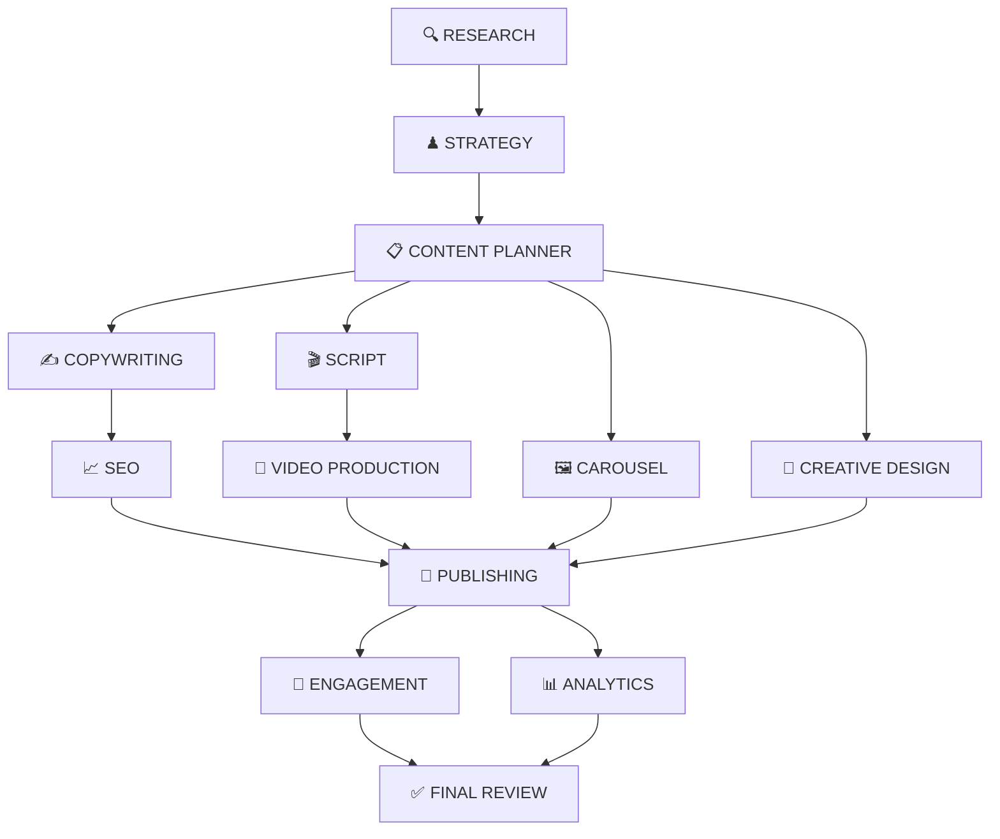

# ContentFlow AI ⚡🤖

**One Topic. Every Platform. Powered by 13 Multi-Agent AI Pipelines.**

ContentFlow AI is an enterprise-grade multi-agent content creation and orchestrating platform. Input a single topic, URL, brief, or product context — 13 specialist AI agents run over a parallel Directed Acyclic Graph (DAG) to generate publish-ready social posts (LinkedIn, X/Twitter, Instagram), video scripts (Reels/Shorts/Podcasts), long-form blog drafts, slide carousels, SEO metadata, engagement playbooks, and analytics strategies.

---

## 🌟 System Architecture & Status

ContentFlow AI is structured as a high-performance TypeScript monorepo containing a **NestJS API backend**, **Vite + React 18 SPA frontend**, and **shared contracts library**.

```
                           ┌───────────────────────────────┐
                           │   Vite + React 18 Web SPA     │
                           │     (Dark Glassmorphism)      │
                           └──────────────┬────────────────┘
                                          │  REST API + WebSockets
                                          ▼
                           ┌───────────────────────────────┐
                           │      NestJS API Gateway       │
                           │  JWT Auth · RBAC · Rate Limit │
                           └──────────────┬────────────────┘
                                          │
                  ┌───────────────────────┼───────────────────────┐
                  ▼                       ▼                       ▼
      ┌──────────────────────┐┌──────────────────────┐┌──────────────────────┐
      │  Prisma + Postgres   ││   BullMQ + Redis 7   ││  13-Agent DAG Runner │
      │ (Multi-Tenant Schema)││  (Async Queue/Worker)││ (Schema Repair Loops)│
      └──────────────────────┘└──────────────────────┘└──────────────────────┘
```

### Production Readiness: **96 / 100** 🚀

| Subsystem | Tech Stack | Status |
| :--- | :--- | :---: |
| **Web Frontend** | Vite, React 18, TypeScript, Vanilla CSS Design System | ✅ 100% Complete |
| **Backend API** | NestJS, TypeScript, Swagger / OpenAPI | ✅ 100% Complete |
| **Multi-Agent DAG** | Custom DAG Orchestrator, BullMQ Worker, Zod Schema Repair | ✅ 100% Complete |
| **Database** | PostgreSQL 18, Prisma ORM (25+ Tables & Models) | ✅ 100% Complete |
| **Queue & Cache** | Redis 7, BullMQ Queue | ✅ 100% Complete |
| **Real-time Gateway** | Socket.IO WebSockets (`/pipeline` namespace) | ✅ 100% Complete |
| **Authentication** | Argon2id Hashing, JWT Rotation, Google & GitHub OAuth | ✅ 100% Complete |
| **Infrastructure** | Docker Compose, Nginx, Kubernetes Manifests (`infra/k8s`) | ✅ 100% Complete |

---

## 🤖 The 13 AI Agents Pipeline

Each agent operates as a specialized LLM worker with strict system prompts and typed Zod output contracts. If an agent produces malformed output, the **LlmService repair loop** feeds the validation issues back to the model for automatic correction.



### Agent Roles & Deliverables

1. **🔍 Research Agent:** Audience analysis, pain points, competitor positioning, viral trends, and core differentiators.
2. **♟ Strategy Agent:** Content pillars, platform selection, positioning angles, and funnel mapping.
3. **📋 Content Planner:** Individual commissioning briefs per platform deliverable with unique asset slugs.
4. **✍️ Copywriting Agent:** LinkedIn posts, X/Twitter threads, Instagram captions, blog drafts, and newsletter copy.
5. **🎬 Script Agent:** Reels, TikToks, Shorts, video scripts, podcast segments, and webinar outlines.
6. **🖼 Carousel Agent:** Slide-by-slide visual decks, hook slides, value slides, and CTA slides.
7. **🎨 Creative Design Agent:** Color palettes, typography pairs, and Midjourney/DALL-E image prompts.
8. **🎥 Video Production Agent:** Storyboards, shot lists, b-roll recommendations, and music direction.
9. **📈 SEO Agent:** Focus keywords, title tags, meta descriptions, heading structure, JSON-LD schema, and hashtags.
10. **📅 Publishing Agent:** Content calendar, optimal posting schedule, cross-posting matrix, and repurposing guidelines.
11. **💬 Engagement Agent:** First comments, reply templates, interactive polls, and staged call-to-actions.
12. **📊 Analytics Agent:** Core KPIs, performance benchmarks, growth forecasts, and A/B test experiments.
13. **✅ Final Review Agent:** Fact-checking flags, brand voice consistency check, and overall readiness score.

---

## 📁 Repository Structure

```
multi-agent/
├── apps/
│   ├── api/                   # NestJS Backend API & Agent Pipeline Engine
│   │   ├── src/
│   │   │   ├── ai/            # LLM Provider Layer (Anthropic, OpenAI, Gemini, Local)
│   │   │   ├── orchestrator/  # DAG Pipeline runner & dependency solver
│   │   │   ├── modules/       # Auth, Projects, Pipelines, Runs, Assets, Workspaces
│   │   │   └── prisma/        # Database schema & migrations
│   │   └── .env               # Backend environment configuration
│   └── web/                   # Vite + React 18 SPA Frontend
│       ├── src/
│       │   ├── api/           # Typed API Client & Auth handlers
│       │   ├── context/       # AuthContext & ToastContext
│       │   ├── components/    # AppShell, Sidebar, Topbar, Modals
│       │   ├── hooks/         # useApi & useRunSocket (WebSocket live stream)
│       │   ├── pages/         # Landing, Login, Register, Dashboard, Pipelines, RunDetail, etc.
│       │   └── index.css      # Dark Glassmorphic Design System
│       └── vite.config.ts     # Proxy configuration (:5173 -> :4000)
├── packages/
│   └── shared/                # Shared TypeScript types, Zod schemas, and contracts
├── infra/
│   ├── docker/                # Nginx & production Dockerfiles
│   └── k8s/                   # Kubernetes deployment & service manifests
├── docker-compose.yml         # Local Postgres 18 & Redis 7 stack
├── test_flow.js               # E2E integration test script
└── package.json               # Monorepo workspace configuration
```

---

## ⚡ Quick Start Guide

### Prerequisites
- **Node.js**: `v20.0.0` or higher
- **PostgreSQL**: `v18.0` (or `v14+`) on port `5432`
- **Redis**: `v7.0` on port `6379`

### 1. Clone & Install Dependencies
```bash
git clone https://github.com/challaudaykumar/multi-agent.git
cd multi-agent
npm install
```

### 2. Configure Environment Variables
Copy `.env.example` in `apps/api/`:
```bash
cp apps/api/.env.example apps/api/.env
```
Key settings in `apps/api/.env`:
```env
PORT=4000
DATABASE_URL=postgresql://challaudaykumar@localhost:5432/contentflow?schema=public
REDIS_HOST=127.0.0.1
REDIS_PORT=6379
JWT_ACCESS_SECRET=fe1c19fc2570a6368033168c80d264dd721e6847b139ca7027753639bdb89b0c
JWT_REFRESH_SECRET=018cb232d8ab4d8af20809d57bd677fcbf013c88dd48591f906ef92d2cd1a9c8
WEB_APP_URL=http://localhost:5173
LLM_PROVIDER=local
```

### 3. Setup Database & Seed Data
```bash
npm run db:push
npm run db:seed
```

### 4. Run Both Backend & Frontend (1 Command)
```bash
npm run dev:all
```
- 🌐 **Web App**: [http://localhost:5173](http://localhost:5173)
- ⚙️ **API Gateway**: [http://localhost:4000/api/v1](http://localhost:4000/api/v1)
- 📖 **Swagger OpenAPI**: [http://localhost:4000/api/v1/docs](http://localhost:4000/api/v1/docs)

---

## 🔑 Offline Mode vs Real LLM Providers

ContentFlow AI includes a **zero-dependency Local Provider** (`LLM_PROVIDER=local`). It deterministically synthesizes valid JSON matching each agent's schema without needing any paid API keys.

To use real AI models, set your credentials in `apps/api/.env`:

```env
# Choose provider: 'anthropic', 'openai', 'gemini', or 'local'
LLM_PROVIDER=anthropic
ANTHROPIC_API_KEY=sk-ant-api03-...

# Or OpenAI
# LLM_PROVIDER=openai
# OPENAI_API_KEY=sk-...

# Or Google Gemini
# LLM_PROVIDER=gemini
# GEMINI_API_KEY=AIzaSy...
```

---

## 📡 API Reference & WebSockets

### Authentication
- `POST /api/v1/auth/register` — Create account & workspace grant
- `POST /api/v1/auth/login` — Exchange credentials for JWT access/refresh pair
- `POST /api/v1/auth/refresh` — Rotate refresh token
- `GET  /api/v1/auth/me` — Fetch current user & organization profile

### Projects & Pipelines
- `GET|POST /api/v1/projects` — Manage workspaces and project campaigns
- `GET|POST /api/v1/pipelines` — Configure agent topics and target platforms
- `POST /api/v1/pipelines/:id/run` — Trigger parallel 13-agent execution

### Runs & Real-Time Monitoring
- `GET /api/v1/runs` — Fetch pipeline run history
- `GET /api/v1/runs/:id` — Inspect individual run status & agent outputs
- `POST /api/v1/runs/:id/cancel` — Terminate running execution
- `POST /api/v1/runs/:id/agents/:agent/rerun` — Re-execute single agent node
- **WebSocket Protocol**: `/pipeline` namespace, listen on `run:event` and `run:done`.

---

## 🧪 Testing & QA Verification

```bash
# Workspace static type check
npm run typecheck

# Backend Jest unit tests (53 passing)
cd apps/api && npm run test

# Frontend Vite production build verification
cd apps/web && npx vite build
```

Full QA Audit report details are documented in [qa_audit_report.md](qa_audit_report.md).

---

## 🐳 Docker & Kubernetes Deployment

### Docker Compose
```bash
docker-compose up -d
```
Spins up PostgreSQL 18, Redis 7, NestJS API container, and Nginx reverse proxy.

### Kubernetes Manifests
Manifests are located under `infra/k8s/`:
```bash
kubectl apply -f infra/k8s/postgres.yaml
kubectl apply -f infra/k8s/redis.yaml
kubectl apply -f infra/k8s/api.yaml
```

---

## 📄 License

Distributed under the MIT License. See `LICENSE` for more information.

*Built with ♥ by [Challa Uday Kumar](https://github.com/challaudaykumar) and 13 AI Agents.*
